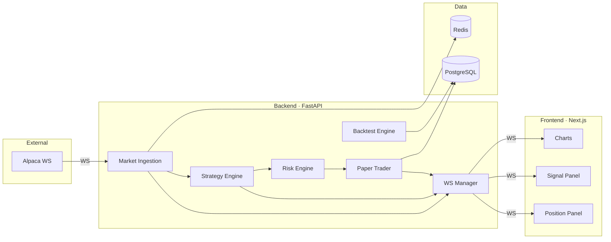

# QuantTerminal — Hackathon Implementation Plan

> Real-time AI-assisted day trading platform · Hackathon build (~24-48 hrs)

---

## Hackathon Strategy

### Core Principle
**Demo the loop, not the polish.** The winning demo is: live data streams in → strategy generates signal → risk check passes → paper trade executes → dashboard updates in real-time. Everything else is secondary.

### What Gets Cut

| Full Plan | Hackathon | Reason |
|---|---|---|
| 8 development phases | 3 sprints | Time compression |
| Parameter optimization | Dropped | Nice-to-have |
| Multi-strategy concurrency | 1-2 strategies max | Complexity |
| Robust fill simulation | Simplified fills | Diminishing returns for demo |
| Full observability stack | Console logging | No prod to monitor |
| JWT auth system | API key or none | Single user, localhost |
| Horizontal scaling | Single process | One machine |
| AI analytics (Phase 8) | Basic LLM journal | Quick win for demo flair |
| Docker production config | docker-compose dev only | No deployment |
| Alembic migrations | Raw SQL init script | Speed |

### What Stays (Non-Negotiable)

- ✅ Live market data streaming (WebSocket)
- ✅ Deterministic strategy engine with at least 2 strategies
- ✅ Real-time signal generation
- ✅ Risk engine (basic: stop loss, position sizing, daily limit)
- ✅ Paper trading with PnL tracking
- ✅ WebSocket push to frontend
- ✅ Live chart with signal markers
- ✅ Positions + PnL dashboard panel
- ✅ Backtest with basic metrics (Sharpe, win rate, max DD)

---

## Architecture (Simplified)



**Key simplification:** No event bus abstraction. Direct async function calls between modules. The event bus pattern is correct architecture but costs time — replace with simple `await` chains for the hackathon and refactor later.

### Data Flow (Hackathon Version)

```
Alpaca WebSocket
  → MarketIngestion.on_bar(data)
    → Normalize to Candle, cache in Redis
    → await StrategyEngine.evaluate(candle)
      → For each active strategy:
          signal = strategy.on_candle(candle, history)
          if signal:
            approved = RiskEngine.check(signal)
            if approved:
              trade = PaperTrader.execute(signal)
              await WSManager.broadcast("trade", trade)
            else:
              await WSManager.broadcast("signal_rejected", reason)
    → await WSManager.broadcast("candle", candle)
```

---

## Sprint Plan

### Sprint 1: Foundation + Data (Hours 0-8)

**Goal:** Backend runs, market data flows, database stores candles.

#### Deliverables
- [ ] `docker-compose.yml` — backend, postgres, redis
- [ ] FastAPI app with health endpoint
- [ ] PostgreSQL schema (init.sql, no Alembic)
- [ ] Redis connection
- [ ] Alpaca WebSocket client (live bars)
- [ ] Candle normalization + DB storage
- [ ] REST endpoint: `GET /api/candles/{symbol}?timeframe=1m`
- [ ] Basic WebSocket server broadcasting candles

#### Backend Structure

```
backend/
├── main.py                  # App factory + lifespan
├── config.py                # Pydantic Settings
├── db.py                    # Async DB session (asyncpg)
├── redis_client.py          # Redis connection
├── models.py                # SQLAlchemy models (all in one file)
├── schemas.py               # Pydantic schemas (all in one file)
├── market/
│   ├── ingestion.py         # Alpaca WS client
│   └── provider.py          # Data provider abstraction
├── strategy/
│   ├── base.py              # BaseStrategy ABC
│   ├── engine.py            # Strategy runner
│   ├── sma_crossover.py     # Built-in strategy
│   └── rsi_reversal.py      # Built-in strategy
├── risk/
│   └── engine.py            # Risk checks
├── trading/
│   ├── paper.py             # Paper trade executor
│   └── positions.py         # Position manager
├── backtest/
│   └── engine.py            # Historical replay
├── ws/
│   └── manager.py           # WebSocket manager
├── routes/
│   ├── market.py
│   ├── strategies.py
│   ├── trades.py
│   └── backtests.py
├── init.sql                 # Schema creation script
├── Dockerfile
└── requirements.txt
```

#### Database Schema (init.sql)

```sql
CREATE EXTENSION IF NOT EXISTS "uuid-ossp";

CREATE TABLE candles (
    id BIGSERIAL PRIMARY KEY,
    symbol VARCHAR(20) NOT NULL,
    timeframe VARCHAR(10) NOT NULL,
    open_time TIMESTAMPTZ NOT NULL,
    open NUMERIC(20,8) NOT NULL,
    high NUMERIC(20,8) NOT NULL,
    low NUMERIC(20,8) NOT NULL,
    close NUMERIC(20,8) NOT NULL,
    volume BIGINT NOT NULL,
    created_at TIMESTAMPTZ DEFAULT NOW(),
    UNIQUE(symbol, timeframe, open_time)
);
CREATE INDEX idx_candles_lookup ON candles(symbol, timeframe, open_time);

CREATE TABLE strategies (
    id UUID PRIMARY KEY DEFAULT uuid_generate_v4(),
    name VARCHAR(100) NOT NULL,
    class_name VARCHAR(100) NOT NULL,
    parameters JSONB DEFAULT '{}',
    symbols TEXT[] NOT NULL,
    timeframe VARCHAR(10) DEFAULT '1m',
    status VARCHAR(20) DEFAULT 'INACTIVE',
    created_at TIMESTAMPTZ DEFAULT NOW()
);

CREATE TABLE signals (
    id BIGSERIAL PRIMARY KEY,
    strategy_id UUID REFERENCES strategies(id),
    symbol VARCHAR(20) NOT NULL,
    direction VARCHAR(10) NOT NULL,
    entry_price NUMERIC(20,8),
    stop_loss NUMERIC(20,8),
    take_profit NUMERIC(20,8),
    confidence FLOAT,
    metadata JSONB DEFAULT '{}',
    generated_at TIMESTAMPTZ DEFAULT NOW()
);

CREATE TABLE trades (
    id UUID PRIMARY KEY DEFAULT uuid_generate_v4(),
    strategy_id UUID REFERENCES strategies(id),
    signal_id BIGINT REFERENCES signals(id),
    symbol VARCHAR(20) NOT NULL,
    side VARCHAR(10) NOT NULL,
    quantity NUMERIC(20,8) NOT NULL,
    entry_price NUMERIC(20,8) NOT NULL,
    exit_price NUMERIC(20,8),
    slippage NUMERIC(20,8) DEFAULT 0,
    commission NUMERIC(20,8) DEFAULT 0,
    pnl NUMERIC(20,8),
    status VARCHAR(20) DEFAULT 'OPEN',
    opened_at TIMESTAMPTZ DEFAULT NOW(),
    closed_at TIMESTAMPTZ
);
CREATE INDEX idx_trades_open ON trades(status) WHERE status = 'OPEN';

CREATE TABLE positions (
    id UUID PRIMARY KEY DEFAULT uuid_generate_v4(),
    strategy_id UUID REFERENCES strategies(id),
    symbol VARCHAR(20) NOT NULL,
    side VARCHAR(10) NOT NULL,
    quantity NUMERIC(20,8) NOT NULL,
    avg_entry NUMERIC(20,8) NOT NULL,
    unrealized_pnl NUMERIC(20,8) DEFAULT 0,
    realized_pnl NUMERIC(20,8) DEFAULT 0,
    opened_at TIMESTAMPTZ DEFAULT NOW(),
    updated_at TIMESTAMPTZ DEFAULT NOW(),
    UNIQUE(strategy_id, symbol)
);

CREATE TABLE backtests (
    id UUID PRIMARY KEY DEFAULT uuid_generate_v4(),
    strategy_id UUID REFERENCES strategies(id),
    symbol VARCHAR(20) NOT NULL,
    timeframe VARCHAR(10) NOT NULL,
    start_date TIMESTAMPTZ NOT NULL,
    end_date TIMESTAMPTZ NOT NULL,
    parameters JSONB DEFAULT '{}',
    metrics JSONB DEFAULT '{}',
    equity_curve JSONB DEFAULT '[]',
    status VARCHAR(20) DEFAULT 'RUNNING',
    created_at TIMESTAMPTZ DEFAULT NOW()
);

CREATE TABLE risk_configs (
    id UUID PRIMARY KEY DEFAULT uuid_generate_v4(),
    strategy_id UUID REFERENCES strategies(id) UNIQUE,
    max_position_size NUMERIC(20,8) DEFAULT 10000,
    max_daily_loss NUMERIC(20,8) DEFAULT 500,
    risk_per_trade FLOAT DEFAULT 0.02,
    stop_loss_pct FLOAT DEFAULT 0.02,
    take_profit_pct FLOAT DEFAULT 0.04,
    cooldown_seconds INT DEFAULT 300
);
```

#### docker-compose.yml

```yaml
services:
  backend:
    build: ./backend
    ports:
      - "8000:8000"
    depends_on:
      postgres:
        condition: service_healthy
      redis:
        condition: service_started
    env_file: .env
    volumes:
      - ./backend:/app
    command: uvicorn main:app --host 0.0.0.0 --port 8000 --reload

  frontend:
    build: ./frontend
    ports:
      - "3000:3000"
    depends_on:
      - backend
    env_file: .env
    volumes:
      - ./frontend:/app
      - /app/node_modules

  postgres:
    image: postgres:16-alpine
    environment:
      POSTGRES_DB: trading
      POSTGRES_USER: trader
      POSTGRES_PASSWORD: traderpw
    ports:
      - "5432:5432"
    volumes:
      - pgdata:/var/lib/postgresql/data
      - ./backend/init.sql:/docker-entrypoint-initdb.d/init.sql
    healthcheck:
      test: ["CMD-SHELL", "pg_isready -U trader -d trading"]
      interval: 5s
      timeout: 5s
      retries: 5

  redis:
    image: redis:7-alpine
    ports:
      - "6379:6379"
    command: redis-server --maxmemory 128mb --maxmemory-policy allkeys-lru

volumes:
  pgdata:
```

#### Sprint 1 Testing
- `docker-compose up` → all services healthy
- Hit `GET /health` → 200
- Alpaca WS connects, candles appear in logs
- `GET /api/candles/AAPL` returns data
- Open wscat → receive candle broadcasts

---

### Sprint 2: Strategy + Risk + Paper Trading (Hours 8-20)

**Goal:** Signals generate from live data, risk engine validates, paper trades execute.

#### Deliverables
- [ ] BaseStrategy abstract class
- [ ] SMA Crossover strategy (working)
- [ ] RSI Reversal strategy (working)
- [ ] Strategy engine: load, subscribe, evaluate on each candle
- [ ] Signal schema + persistence
- [ ] Risk engine: stop loss, position sizing, daily loss limit
- [ ] Paper trade executor with simplified fills
- [ ] Position manager with unrealized PnL updates
- [ ] REST endpoints: strategy CRUD, start/stop, trades, positions
- [ ] WebSocket broadcasts: signals, trades, positions
- [ ] Basic backtest engine with core metrics

#### Strategy Base Class

```python
class BaseStrategy(ABC):
    name: str
    symbols: List[str]
    timeframe: str = "1m"
    parameters: Dict[str, Any] = {}
    lookback: int = 50

    @abstractmethod
    async def on_candle(self, symbol: str, candle: dict,
                        history: pd.DataFrame) -> Optional[dict]:
        """Return signal dict or None."""
        # {"direction": "LONG|SHORT|CLOSE", "confidence": 0.0-1.0}
        pass
```

#### Risk Engine (Simplified)

```python
class RiskEngine:
    def check(self, signal, account_state, risk_config) -> tuple[bool, str]:
        # 1. Position size check
        # 2. Daily loss check
        # 3. Calculate proper position size
        # 4. Attach stop loss + take profit
        return approved, reason
```

#### Paper Trader (Simplified Fills)

```python
class PaperTrader:
    SLIPPAGE_BPS = 5            # 0.05%
    COMMISSION_PER_SHARE = 0.005

    async def execute(self, signal) -> Trade:
        slippage = signal.entry_price * Decimal("0.0005")
        fill_price = signal.entry_price + slippage
        commission = signal.quantity * Decimal("0.005")
        # Create/update position, persist trade, return
```

#### Backtest Engine (Minimal)

```python
class BacktestEngine:
    async def run(self, strategy_class, params, symbol,
                  timeframe, start, end) -> dict:
        candles = await db.fetch_candles(...)
        strategy = strategy_class(**params)
        account = VirtualAccount(capital=100_000)

        for i, candle in enumerate(candles):
            history = candles[max(0, i-strategy.lookback):i+1]
            signal = await strategy.on_candle(symbol, candle, history)
            if signal: # risk check + fill

        return {"total_return", "sharpe_ratio", "max_drawdown",
                "win_rate", "profit_factor", "equity_curve"}
```

#### Sprint 2 Testing
- Create strategy via API, activate it
- Observe signals in WebSocket stream
- Risk engine rejects oversized positions
- Paper trades appear in DB with correct PnL
- Backtest on 1 month of data, verify sane metrics
- Daily loss limit stops trading when breached

---

### Sprint 3: Frontend Dashboard (Hours 20-30+)

**Goal:** Professional dashboard that demos the full loop in real-time.

#### Deliverables
- [ ] Next.js 15 app with TailwindCSS dark theme
- [ ] WebSocket client with auto-reconnect
- [ ] Zustand stores (market, signals, positions)
- [ ] Live candlestick chart (TradingView Lightweight Charts)
- [ ] Signal markers on chart
- [ ] Live signals feed panel
- [ ] Open positions panel with real-time PnL
- [ ] Strategy management page (list, start/stop)
- [ ] Backtest results page with equity curve
- [ ] Key metrics cards (daily PnL, win rate, equity)

#### Frontend Structure

```
frontend/
├── app/
│   ├── layout.tsx            # Dark theme shell, WS provider
│   ├── page.tsx              # Main dashboard
│   ├── strategies/page.tsx   # Strategy list + controls
│   └── backtests/page.tsx    # Backtest runner + results
├── components/
│   ├── PriceChart.tsx        # TradingView Lightweight Charts
│   ├── SignalFeed.tsx        # Live signal list
│   ├── PositionTable.tsx     # Open positions + PnL
│   ├── MetricsBar.tsx        # Top-level KPI cards
│   ├── EquityCurve.tsx       # Backtest equity chart
│   └── StrategyCard.tsx      # Strategy with start/stop
├── lib/
│   ├── ws.ts                 # WebSocket client class
│   └── api.ts                # REST fetch wrapper
├── stores/
│   ├── market.ts
│   ├── signals.ts
│   └── positions.ts
└── types.ts
```

#### Dashboard Layout

```
┌─────────────────────────────────────────────────────┐
│ QuantTerminal  │ PnL: +$342 │ Equity: $102k │ 2 act │
├────────────────────────────────────┬────────────────┤
│                                    │ Signals        │
│     Candlestick Chart              │ LONG AAPL 0.85 │
│     (TradingView Lightweight)      │ SHORT TSLA 0.72│
│     + Signal markers               │ ...            │
│     + Entry/exit lines             │                │
├────────────────────────────────────┼────────────────┤
│ Open Positions                     │ Metrics        │
│ Sym  │Side│Entry │ PnL   │Action  │ Win: 62%       │
│ AAPL │LONG│$189  │+$230  │Close   │ Sharpe: 1.8    │
│ TSLA │SHRT│$245  │-$45   │Close   │ PF: 2.1        │
└────────────────────────────────────┴────────────────┘
```

#### Sprint 3 Testing
- Dashboard loads, WS connects, candles stream on chart
- Signals appear in panel as they generate
- Positions update with live PnL (green/red)
- Strategy start/stop works from UI
- Backtest page: run backtest, see equity curve + metrics

---

## API Endpoints

### Market
| Method | Path | Description |
|---|---|---|
| GET | `/api/candles/{symbol}` | Historical candles (query: timeframe, start, end) |
| GET | `/api/symbols` | Available symbols |
| GET | `/health` | Health check |

### Strategies
| Method | Path | Description |
|---|---|---|
| GET | `/api/strategies` | List all strategies |
| POST | `/api/strategies` | Create strategy instance |
| POST | `/api/strategies/{id}/start` | Activate strategy |
| POST | `/api/strategies/{id}/stop` | Deactivate strategy |
| GET | `/api/strategies/available` | List strategy classes |

### Trading
| Method | Path | Description |
|---|---|---|
| GET | `/api/positions` | Open positions |
| GET | `/api/trades` | Trade history |
| POST | `/api/positions/{id}/close` | Manual close position |
| GET | `/api/account` | Account equity + daily PnL |

### Backtests
| Method | Path | Description |
|---|---|---|
| POST | `/api/backtests` | Run a backtest |
| GET | `/api/backtests` | List backtests |
| GET | `/api/backtests/{id}` | Backtest results + equity curve |

### Risk
| Method | Path | Description |
|---|---|---|
| GET | `/api/risk/{strategy_id}` | Get risk config |
| PUT | `/api/risk/{strategy_id}` | Update risk config |

### WebSocket
| Path | Description |
|---|---|
| `ws://host/ws` | Real-time: candles, signals, trades, positions |

---

## Demo Script (2-3 minutes)

```
1. "This is QuantTerminal — a real-time AI-assisted trading platform."
   → Show dashboard with live chart streaming

2. "Strategies are deterministic and configurable."
   → Start SMA Crossover on AAPL
   → Signal appears on chart in real-time

3. "Every signal passes through a risk engine."
   → Show signal with stop loss / take profit
   → Show a rejected signal with reason

4. "Paper trading simulates realistic execution."
   → Show open position with live PnL updating
   → Show trade history with slippage/commission

5. "Backtest before you deploy."
   → Run backtest, show equity curve + metrics

6. "Built for extensibility."
   → Architecture diagram
   → Mention: multi-broker, AI analytics, portfolio optimization
```

---

## Risk Mitigation

| Risk | Mitigation |
|---|---|
| Alpaca API issues | Pre-download 1 month candle data as JSON fallback |
| WebSocket flaky on demo WiFi | Build replay mode that plays stored candles as if live |
| Strategy never signals during demo | Pre-tune SMA params so signals fire every ~5-10 min |
| DB performance on laptop | 1-2 symbols, 1 month max |
| Frontend doesn't compile | Demo backend via FastAPI Swagger + wscat |

> [!IMPORTANT]
> **Fallback plan:** If frontend isn't ready, demo the full backend via Swagger UI + wscat for WebSocket. The backend IS the product.

---

## Pre-Hackathon Checklist

```
□ Docker Desktop installed and running
□ Alpaca paper trading account created (free)
□ API keys in .env file
□ Download 1 month AAPL + TSLA 1m candles (yfinance)
□ Node.js 20+ installed
□ Python 3.12 installed
□ Test docker-compose up with empty backend
□ Clone TradingView Lightweight Charts example
```

---

## Timeline Summary

| Sprint | Hours | Deliverable |
|---|---|---|
| 1: Foundation + Data | 0-8 | Docker, DB, market data streaming |
| 2: Engine + Trading | 8-20 | Strategies, risk, paper trading, backtest |
| 3: Frontend | 20-30 | Dashboard, charts, real-time UI |
| **Total** | **~30 hrs** | **Full demo-ready platform** |
