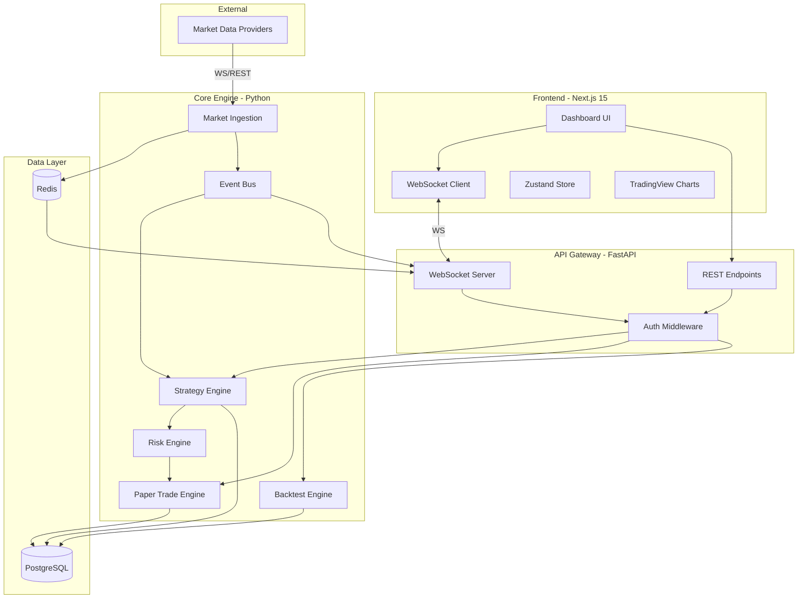
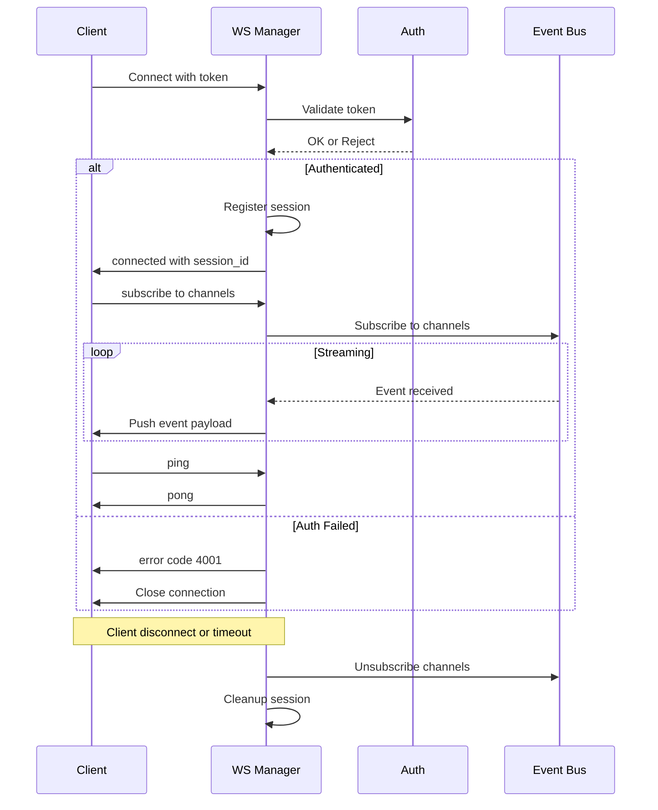
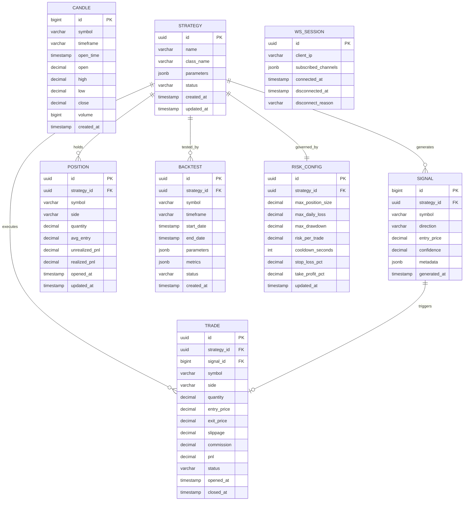

# Real-Time AI-Assisted Day Trading Platform — Implementation Plan (Part 1)

> Systems Architecture Document & Technical Roadmap

---

## 1. SYSTEM ARCHITECTURE

### 1.1 High-Level Architecture



### 1.2 Service Boundaries

| Service | Responsibility | Communication |
|---|---|---|
| **Market Ingestion** | Connect to providers, normalize data, publish candles/ticks | Writes to Redis pub/sub, publishes to Event Bus |
| **Strategy Engine** | Load strategies, subscribe to data, generate signals | Reads from Event Bus, emits signals |
| **Risk Engine** | Validate signals against risk rules before execution | Synchronous gate in execution pipeline |
| **Paper Trade Engine** | Simulate order fills, manage positions, track PnL | Reads validated signals, writes to PostgreSQL |
| **Backtest Engine** | Replay historical data through strategies | Reads from PostgreSQL, writes results |
| **Event Bus** | Decouple producers/consumers via async channels | In-process asyncio + Redis pub/sub |
| **WebSocket Manager** | Manage client connections, broadcast updates | Reads from Event Bus, pushes to clients |
| **API Gateway** | REST endpoints, authentication, request routing | HTTP + WS entry point |

### 1.3 Data Flow — Signal Lifecycle

```
Market Provider
  -> Market Ingestion Service (normalize, validate)
    -> Redis (cache latest candle/tick)
    -> Event Bus: "candle.{symbol}.{timeframe}"
      -> Strategy Engine (evaluate all subscribed strategies)
        -> Signal generated: {symbol, direction, confidence, strategy_id, ts}
          -> Risk Engine (validate against rules)
            -> IF PASS -> Paper Trade Engine (simulate fill)
              -> Position update -> PnL recalc
              -> Event Bus: "trade.executed" / "position.updated"
                -> WebSocket Manager -> Frontend
            -> IF REJECT -> Event Bus: "signal.rejected" (with reason)
              -> WebSocket Manager -> Frontend
```

### 1.4 WebSocket Lifecycle



**WebSocket Design Rules:**
- Heartbeat: 15s client ping, 30s server timeout
- Reconnection: exponential backoff (1s, 2s, 4s, 8s, max 30s)
- Message format: JSON `{type, channel, data, timestamp}`
- Subscription management: per-session channel registry in Redis
- Graceful shutdown: drain in-flight messages, send close frame

### 1.5 Event Bus Topics

```
candle.{symbol}.{timeframe}   — New candle data
tick.{symbol}                 — Raw tick data
signal.generated              — Strategy produced a signal
signal.rejected               — Risk engine rejected signal
trade.executed                — Paper trade filled
position.updated              — Position changed
backtest.progress             — Backtest status update
backtest.complete             — Backtest finished
system.alert                  — Risk alerts, errors
strategy.status               — Strategy started/stopped/error
```

- **In-process**: `asyncio.Queue` per subscriber, zero-copy for co-located services
- **Cross-process**: Redis pub/sub for horizontal scaling later
- **Delivery**: at-most-once (acceptable for market data), idempotent consumers

---

## 2. DEVELOPMENT PHASES

### Phase 1: Infrastructure Foundation

| Attribute | Detail |
|---|---|
| **Objective** | Project skeleton, Docker, database, Redis, FastAPI server |
| **Deliverables** | docker-compose.yml, FastAPI scaffold, Alembic migrations, Redis connection, health endpoints, logging |
| **Dependencies** | None |
| **Complexity** | Low-Medium |
| **Duration** | 3-4 days |

**Pitfalls:** Skipping Alembic early; not using asyncpg from day one; Docker networking issues.

**Testing:** Health returns 200, DB migrations run, Redis pings, docker-compose up/down clean.

---

### Phase 2: Market Data Ingestion

| Attribute | Detail |
|---|---|
| **Objective** | Connect to market data source, normalize candles, publish to event bus, cache in Redis |
| **Deliverables** | Market data WS client, candle normalizer, Redis cache, event bus publisher, historical backfill CLI |
| **Dependencies** | Phase 1 |
| **Complexity** | Medium-High |
| **Duration** | 5-7 days |

**Data Sources (priority):** 1) Alpaca Markets (free, WS+REST, paper API) 2) Polygon.io 3) yfinance (historical fallback)

**Pitfalls:** WS disconnects from providers; timezone handling; rate limits on backfill; partial candles at market open/close.

**Testing:** Candle data integrity (OHLCV), compare against known source, test reconnection, verify Redis TTL.

---

### Phase 3: Strategy Engine

| Attribute | Detail |
|---|---|
| **Objective** | Strategy loading, execution loop, signal generation pipeline |
| **Deliverables** | Strategy base class, registry, data subscription, signal schema, 2-3 built-in strategies |
| **Dependencies** | Phase 2 |
| **Complexity** | High |
| **Duration** | 7-10 days |

**Pitfalls:** Tight coupling to data format; one bad strategy killing all; ignoring look-back buffer on startup.

**Testing:** Unit test each strategy with known data. Integration: feed historical candles, verify expected signals.

---

### Phase 4: Paper Trading Engine

| Attribute | Detail |
|---|---|
| **Objective** | Simulate trade execution with realistic fills, manage positions, track PnL |
| **Deliverables** | Order manager, fill simulator, position tracker, PnL calculator, trade log |
| **Dependencies** | Phase 3 |
| **Complexity** | High |
| **Duration** | 7-10 days |

**Pitfalls:** Ignoring slippage/fees; float precision (use Decimal); race conditions between signals and positions.

**Testing:** Verify fills at expected prices +/- slippage, PnL against manual calc, edge cases.

---

### Phase 5: Backtesting System

| Attribute | Detail |
|---|---|
| **Objective** | Replay historical data through strategies, generate metrics |
| **Deliverables** | Replay engine, metrics (Sharpe, Sortino, max DD, win rate), parameter sweep, results storage |
| **Dependencies** | Phase 3, Phase 4 |
| **Complexity** | High |
| **Duration** | 7-10 days |

**Pitfalls:** Look-ahead bias; survivorship bias; not accounting for market hours/gaps; vectorbt integration.

**Testing:** Known strategy on known data, compare metrics vs manual. Verify no future data leakage.

---

### Phase 6: Frontend Dashboard

| Attribute | Detail |
|---|---|
| **Objective** | Minimal professional dashboard with real-time charts, signals, positions |
| **Deliverables** | Next.js app, WS client, chart page, signals panel, positions table, backtest viewer |
| **Dependencies** | Phases 1-5 |
| **Complexity** | Medium |
| **Duration** | 7-10 days |

**Pitfalls:** Over-engineering UI before backend is stable; WS reconnection in React lifecycle; chart perf.

**Testing:** Visual verification, WS reconnection test, chart rendering under load.

---

### Phase 7: Risk Engine and Optimization

| Attribute | Detail |
|---|---|
| **Objective** | Risk controls, latency optimization, system hardening |
| **Deliverables** | Risk engine (stop loss, take profit, drawdown, daily limits), latency profiling, connection tuning |
| **Dependencies** | Phase 4 |
| **Complexity** | Medium-High |
| **Duration** | 5-7 days |

**Pitfalls:** Risk checks too slow; edge cases in drawdown during overnight gaps.

**Testing:** Trigger every risk rule synthetically. Verify positions close when limits breach.

---

### Phase 8: AI-Assisted Analytics

| Attribute | Detail |
|---|---|
| **Objective** | LLM-assisted journaling, pattern commentary, strategy suggestions |
| **Deliverables** | LLM integration service, trade journal with AI summaries, strategy suggestion endpoint |
| **Dependencies** | Phase 4, Phase 5 |
| **Complexity** | Medium |
| **Duration** | 5-7 days |

> [!CAUTION]
> AI NEVER executes trades. AI provides analysis on completed trades and historical patterns ONLY.

**Testing:** Verify AI output is advisory only. Test rate limiting. Verify no execution pathway from AI output.

---

## 3. BACKEND ARCHITECTURE

### 3.1 FastAPI Project Structure

```
backend/
├── main.py                      # App factory, lifespan events
├── config.py                    # Pydantic Settings (env-based)
├── dependencies.py              # FastAPI dependency injection
├── api/
│   ├── routes/
│   │   ├── health.py            # Health / readiness probes
│   │   ├── market.py            # Market data REST endpoints
│   │   ├── strategies.py        # Strategy CRUD, start/stop
│   │   ├── trades.py            # Trade history, positions
│   │   ├── backtests.py         # Backtest CRUD, results
│   │   ├── risk.py              # Risk config endpoints
│   │   └── ai.py                # AI analytics endpoints
│   └── websocket/
│       ├── manager.py           # Connection registry, broadcast
│       ├── handlers.py          # Message type handlers
│       └── auth.py              # WS authentication
├── core/
│   ├── event_bus.py             # Async pub/sub event bus
│   ├── market_ingestion.py      # Provider connections
│   ├── strategy_engine.py       # Strategy loader, execution loop
│   ├── risk_engine.py           # Risk validation pipeline
│   ├── paper_trading.py         # Simulated execution engine
│   ├── backtest_engine.py       # Historical replay engine
│   └── ai_service.py           # LLM integration (advisory only)
├── models/
│   ├── database.py              # SQLAlchemy models
│   ├── schemas.py               # Pydantic schemas
│   └── events.py                # Event type definitions
├── strategies/
│   ├── base.py                  # Abstract strategy base class
│   ├── registry.py              # Strategy discovery
│   ├── sma_crossover.py
│   ├── rsi_reversal.py
│   └── vwap_bounce.py
├── db/
│   ├── session.py               # Async session factory
│   ├── migrations/              # Alembic
│   └── repositories/
│       ├── candle_repo.py
│       ├── trade_repo.py
│       ├── strategy_repo.py
│       └── backtest_repo.py
├── utils/
│   ├── logging.py               # structlog setup
│   ├── metrics.py               # Latency tracking
│   └── time.py                  # Timezone utils
└── tests/
    ├── unit/
    ├── integration/
    └── conftest.py
```

### 3.2 WebSocket Manager

```python
class WebSocketManager:
    """
    connections: Dict[session_id, WebSocketState]
    subscriptions: Dict[channel, Set[session_id]]
    Uses Redis pub/sub as backing for horizontal scaling.
    """
    async def connect(ws, token) -> session_id
    async def disconnect(session_id)
    async def subscribe(session_id, channels: List[str])
    async def unsubscribe(session_id, channels: List[str])
    async def broadcast(channel: str, payload: dict)
    async def send_to(session_id, payload: dict)
    async def heartbeat_loop()   # Prune dead connections
```

### 3.3 Async Task Orchestration

```
FastAPI Lifespan:
  on_startup:
    1. Init DB pool (asyncpg)
    2. Init Redis pool
    3. Start Event Bus
    4. Start Market Ingestion (asyncio.Task)
    5. Start Strategy Engine loop (asyncio.Task)
    6. Start WS heartbeat loop (asyncio.Task)
    7. Log system ready

  on_shutdown:
    1. Stop Market Ingestion (graceful WS close)
    2. Stop Strategy Engine (drain pending signals)
    3. Close all WebSocket connections (close frame)
    4. Flush pending writes to PostgreSQL
    5. Close DB pool
    6. Close Redis pool
```

### 3.4 Logging

- **Library**: `structlog` with JSON output
- **Levels**: DEBUG in dev, INFO in production
- **Context**: `{timestamp, service, correlation_id, level, message}`
- **Trade logs**: Separate logger for audit trail (immutable)
- **Perf**: Log latency of critical paths (signal gen, risk check, fill sim)

---

## 4. DATA MODEL DESIGN

### 4.1 Entity Relationship



### 4.2 Indexing Strategy

| Table | Index | Type | Rationale |
|---|---|---|---|
| `candle` | `(symbol, timeframe, open_time)` | UNIQUE B-tree | Primary lookup, prevents dupes |
| `candle` | `(open_time)` | B-tree | Time-range queries for backtest |
| `signal` | `(strategy_id, generated_at)` | B-tree | Signal history per strategy |
| `trade` | `(strategy_id, opened_at)` | B-tree | Trade history per strategy |
| `trade` | `(status) WHERE status='OPEN'` | Partial B-tree | Active trade lookup |
| `position` | `(strategy_id, symbol)` | UNIQUE | One position per symbol per strategy |
| `backtest` | `(strategy_id, created_at)` | B-tree | Backtest history |

### 4.3 Key Decisions

- **`decimal` not `float`** for all monetary values — no floating point errors
- **`jsonb` for strategy parameters** — flexible schema per strategy type
- **`uuid` for business entities, `bigint` for high-volume tables** (candles, signals)
- **Partition `candle` table by month** once data exceeds ~50M rows
- **Soft-delete trades** (status field) — never hard delete for audit trail
