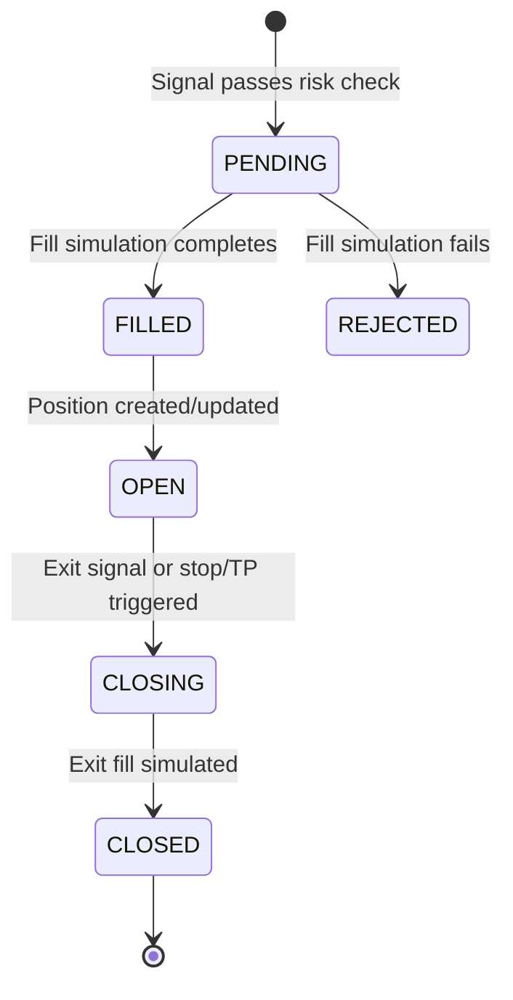

# Real-Time AI-Assisted Day Trading Platform — Implementation Plan (Part 2)

> Strategy Engine, Risk Engine, Paper Trading, Backtesting

---

## 5. STRATEGY ENGINE DESIGN

### 5.1 Strategy Base Class

```python
class BaseStrategy(ABC):
    """All strategies inherit from this. Enforces interface contract."""

    name: str
    version: str
    symbols: List[str]
    timeframes: List[str]
    parameters: Dict[str, Any]       # User-configurable
    lookback_required: int           # Min candles before first signal

    @abstractmethod
    async def on_candle(self, symbol: str, timeframe: str,
                        candle: Candle, history: pd.DataFrame) -> Optional[Signal]:
        """Called on each new candle. Return Signal or None."""

    @abstractmethod
    def validate_parameters(self, params: dict) -> bool:
        """Validate parameter configuration."""

    def on_start(self): ...          # Lifecycle hook
    def on_stop(self): ...           # Lifecycle hook
    def on_error(self, error): ...   # Error hook
```

### 5.2 Strategy Loading and Registry

```
Strategy Discovery Flow:
  1. On startup, StrategyRegistry scans `strategies/` directory
  2. Each .py file with a class inheriting BaseStrategy is registered
  3. Registry stores: {class_name -> class_reference, metadata}
  4. User creates strategy instance via REST API:
     POST /api/strategies
     {name, class_name, parameters, symbols, timeframes}
  5. Instance stored in PostgreSQL with status="INACTIVE"
  6. User activates: POST /api/strategies/{id}/start
  7. StrategyEngine loads instance, subscribes to relevant event bus topics
```

**Registry pattern:**
```python
class StrategyRegistry:
    _strategies: Dict[str, Type[BaseStrategy]] = {}

    @classmethod
    def register(cls, strategy_class):
        cls._strategies[strategy_class.__name__] = strategy_class

    @classmethod
    def get(cls, class_name) -> Type[BaseStrategy]:
        return cls._strategies[class_name]

    @classmethod
    def list_available(cls) -> List[StrategyMeta]:
        return [meta for meta in cls._strategies.values()]
```

### 5.3 Market Data Subscription

```
StrategyEngine maintains:
  subscriptions: Dict[topic, List[StrategyInstance]]

  Example:
    "candle.AAPL.1m" -> [sma_cross_instance, rsi_instance]
    "candle.TSLA.5m" -> [vwap_instance]

When Event Bus publishes "candle.AAPL.1m":
  1. StrategyEngine receives event
  2. Looks up all subscribed strategy instances
  3. For each instance (concurrently via asyncio.gather):
     a. Fetch history from Redis/DB (rolling window)
     b. Call strategy.on_candle(symbol, timeframe, candle, history)
     c. If Signal returned -> publish to "signal.generated"
  4. Errors are caught per-strategy (never propagate across strategies)
```

### 5.4 Signal Generation

```python
@dataclass
class Signal:
    strategy_id: uuid
    symbol: str
    direction: Literal["LONG", "SHORT", "CLOSE"]
    entry_price: Decimal
    suggested_stop: Optional[Decimal]
    suggested_target: Optional[Decimal]
    confidence: float              # 0.0 - 1.0
    timeframe: str
    metadata: dict                 # Strategy-specific context
    generated_at: datetime

    # Signals are DETERMINISTIC:
    # Same candle data + same parameters = same signal. Always.
```

### 5.5 Strategy Sandboxing

| Mechanism | Implementation |
|---|---|
| **Error isolation** | Each `on_candle` call wrapped in try/except; errors logged, strategy marked `ERROR` after N consecutive failures |
| **Timeout** | `asyncio.wait_for(strategy.on_candle(...), timeout=5.0)` — kill slow strategies |
| **Resource limits** | Max history DataFrame size (10,000 rows); max memory per strategy tracked |
| **Parameter validation** | `validate_parameters()` called before activation; reject invalid configs |
| **No I/O** | Strategies cannot make network calls or file I/O; they receive data, return signals |
| **No shared state** | Each strategy instance has its own state; no cross-strategy mutation |

### 5.6 Concurrent Strategy Execution

```
Strategy Engine Loop (async):

  while running:
    event = await event_bus.receive("candle.*")
    topic = event.topic
    instances = subscriptions[topic]

    # Fan-out: execute all subscribed strategies concurrently
    results = await asyncio.gather(
        *[execute_strategy(inst, event) for inst in instances],
        return_exceptions=True
    )

    for result in results:
        if isinstance(result, Signal):
            await event_bus.publish("signal.generated", result)
        elif isinstance(result, Exception):
            log.error("strategy_error", strategy=inst.name, error=result)
```

**Performance target:** Signal generation latency < 50ms per strategy per candle.

---

## 6. RISK ENGINE DESIGN

### 6.1 Pipeline Position

```
Signal Generated
  -> Risk Engine (synchronous validation gate)
    -> Pre-trade checks:
       1. Position size validation
       2. Daily loss limit check
       3. Max drawdown check
       4. Cooldown period check
       5. Risk-per-trade sizing
    -> Post-validation:
       IF ALL PASS -> attach stop_loss + take_profit -> Paper Trade Engine
       IF ANY FAIL -> emit "signal.rejected" with reason code
```

> [!IMPORTANT]
> The Risk Engine is a **synchronous gate** in the execution pipeline. It must be fast (< 5ms) and never block on I/O. All state it needs is cached in memory, refreshed from DB periodically.

### 6.2 Risk Rules

#### Stop Loss Handling
```
Types:
  - Fixed percentage: e.g., 2% below entry
  - ATR-based: e.g., 1.5x ATR(14) below entry
  - Structure-based: configurable via strategy metadata

Implementation:
  - Stop loss price attached to every order before submission
  - Paper Trade Engine monitors price against stop on each tick/candle
  - If triggered: immediate market close at stop price (+ slippage)
  - Trailing stop: optional, recalculates on each candle if price moves favorably
```

#### Take Profit Handling
```
Types:
  - Fixed percentage: e.g., 4% above entry (2:1 R:R)
  - ATR-based: e.g., 3x ATR(14) above entry
  - Partial exits: e.g., close 50% at 1R, trail rest

Implementation:
  - Take profit levels attached to order
  - Paper Trade Engine monitors and fills at target
  - Partial exit creates new position entry for remainder
```

#### Max Drawdown Protection
```
Calculation:
  peak_equity = max(equity_history)
  current_dd = (peak_equity - current_equity) / peak_equity

  if current_dd >= max_drawdown_threshold:
    -> Close ALL open positions
    -> Disable ALL active strategies
    -> Emit "system.alert" with DRAWDOWN_BREACH
    -> Require manual re-enable

State: peak_equity tracked in-memory, persisted to Redis every 30s
```

#### Daily Loss Limits
```
  daily_pnl = sum(realized_pnl for trades closed today)

  if abs(daily_pnl) >= daily_loss_limit:
    -> Reject all new signals for remainder of day
    -> Emit "system.alert" with DAILY_LIMIT_REACHED
    -> Auto-reset at market open next day

State: daily_pnl tracked in-memory, reset on schedule
```

#### Risk-Per-Trade Sizing
```
  position_size = (account_equity * risk_per_trade) / (entry - stop_loss)

  Constraints:
    - Never exceed max_position_size
    - Never exceed max_portfolio_exposure (sum of all positions)
    - Round to valid lot size
```

#### Cooldown System
```
  After a losing trade:
    cooldown_until = trade.closed_at + cooldown_duration

  After N consecutive losses:
    extended_cooldown = base_cooldown * loss_streak_multiplier

  During cooldown:
    -> All signals for that strategy+symbol pair are rejected
    -> Reason: "COOLDOWN_ACTIVE"
```

### 6.3 Risk Config Schema

```python
class RiskConfig:
    max_position_size: Decimal       # Max $ per position
    max_portfolio_exposure: Decimal  # Max $ total across all positions
    max_daily_loss: Decimal          # Max daily realized loss
    max_drawdown_pct: float          # Max drawdown from equity peak (0.0-1.0)
    risk_per_trade_pct: float        # % of equity risked per trade
    stop_loss_pct: float             # Default stop loss %
    take_profit_pct: float           # Default take profit %
    cooldown_seconds: int            # Post-loss cooldown
    max_consecutive_losses: int      # Before extended cooldown
    trailing_stop_enabled: bool
    trailing_stop_pct: float
```

---

## 7. PAPER TRADING ENGINE

### 7.1 Order Lifecycle



### 7.2 Fill Simulation

```python
class FillSimulator:
    """
    Simulates realistic order fills with slippage and fees.
    """
    def simulate_fill(self, order: Order, current_candle: Candle) -> Fill:
        # 1. Slippage model
        slippage = self._calculate_slippage(order, current_candle)

        # 2. Fill price
        if order.side == "BUY":
            fill_price = order.price + slippage
        else:
            fill_price = order.price - slippage

        # 3. Verify fill is within candle range (realistic)
        if not (current_candle.low <= fill_price <= current_candle.high):
            return Fill(status="REJECTED", reason="price_outside_range")

        # 4. Commission
        commission = self._calculate_commission(order.quantity, fill_price)

        return Fill(
            price=fill_price,
            quantity=order.quantity,
            slippage=slippage,
            commission=commission,
            filled_at=current_candle.open_time,
            status="FILLED"
        )

    def _calculate_slippage(self, order, candle):
        """
        Slippage model based on spread + volume impact.
        Base: 0.01% of price
        Volume impact: increases if order size > 1% of candle volume
        """
        base_slippage = order.price * Decimal("0.0001")
        vol_ratio = order.quantity / max(candle.volume, 1)
        impact = base_slippage * Decimal(str(min(vol_ratio * 10, 1.0)))
        return base_slippage + impact

    def _calculate_commission(self, quantity, price):
        """Per-share: $0.005/share, min $1.00"""
        return max(quantity * Decimal("0.005"), Decimal("1.00"))
```

### 7.3 Position Management

```python
class PositionManager:
    """
    Tracks open positions per strategy.
    Calculates unrealized PnL on each price update.
    """
    positions: Dict[Tuple[strategy_id, symbol], Position]

    async def open_position(self, fill: Fill, strategy_id, signal: Signal):
        key = (strategy_id, fill.symbol)
        if key in self.positions:
            # Average into existing position
            self._average_position(key, fill)
        else:
            self.positions[key] = Position(
                strategy_id=strategy_id,
                symbol=fill.symbol,
                side=signal.direction,
                quantity=fill.quantity,
                avg_entry=fill.price,
                unrealized_pnl=Decimal(0),
                opened_at=fill.filled_at
            )
        await self._persist(key)
        await event_bus.publish("position.updated", self.positions[key])

    async def update_unrealized_pnl(self, symbol, current_price):
        """Called on each candle/tick for all positions in symbol."""
        for key, pos in self.positions.items():
            if pos.symbol == symbol:
                if pos.side == "LONG":
                    pos.unrealized_pnl = (current_price - pos.avg_entry) * pos.quantity
                else:
                    pos.unrealized_pnl = (pos.avg_entry - current_price) * pos.quantity
                # Subtract commission already paid
                pos.unrealized_pnl -= pos.total_commission

    async def close_position(self, key, fill: Fill):
        pos = self.positions[key]
        if pos.side == "LONG":
            realized = (fill.price - pos.avg_entry) * pos.quantity
        else:
            realized = (pos.avg_entry - fill.price) * pos.quantity
        realized -= (pos.total_commission + fill.commission)

        trade = Trade(
            strategy_id=pos.strategy_id,
            symbol=pos.symbol,
            side=pos.side,
            quantity=pos.quantity,
            entry_price=pos.avg_entry,
            exit_price=fill.price,
            slippage=fill.slippage,
            commission=fill.commission,
            pnl=realized,
            status="CLOSED",
            opened_at=pos.opened_at,
            closed_at=fill.filled_at
        )
        del self.positions[key]
        await self._persist_trade(trade)
        await event_bus.publish("trade.executed", trade)
```

### 7.4 PnL Tracking

```
Real-time PnL computation:

  Unrealized PnL (per position):
    LONG:  (current_price - avg_entry) * quantity - commissions
    SHORT: (avg_entry - current_price) * quantity - commissions

  Realized PnL (per trade):
    Computed on close. Stored in trade record.

  Account Equity:
    starting_capital + sum(realized_pnl) + sum(unrealized_pnl)

  Daily PnL:
    sum(realized_pnl WHERE closed_at >= today_market_open)
    + sum(unrealized_pnl_delta since today_market_open)

Update frequency: on each candle close (1m default)
Storage: current state in Redis (fast reads), snapshots in PostgreSQL (audit)
```

---

## 8. BACKTESTING SYSTEM

### 8.1 Historical Replay Engine

```
Backtest Execution Flow:

  1. User submits backtest request:
     POST /api/backtests
     {strategy_id, symbol, timeframe, start_date, end_date, parameters}

  2. BacktestEngine spawns async task:
     a. Load strategy class + parameters
     b. Query candles from PostgreSQL for date range
     c. Initialize virtual account (capital, no positions)
     d. Initialize strategy with lookback buffer

  3. Replay loop (sequential, no parallelism for determinism):
     for each candle in chronological order:
       a. Update virtual market state
       b. Check pending orders (stop/TP hits within candle H/L)
       c. Call strategy.on_candle(symbol, tf, candle, history)
       d. If signal -> risk check -> fill simulation -> position update
       e. Update equity curve
       f. Emit "backtest.progress" every N candles

  4. On completion:
     a. Calculate metrics
     b. Store results in PostgreSQL
     c. Emit "backtest.complete"
```

### 8.2 Metrics Generation

| Metric | Formula |
|---|---|
| **Total Return** | `(final_equity - initial_equity) / initial_equity` |
| **Annualized Return** | `total_return * (252 / trading_days)` |
| **Sharpe Ratio** | `mean(daily_returns) / std(daily_returns) * sqrt(252)` |
| **Sortino Ratio** | `mean(daily_returns) / downside_std * sqrt(252)` |
| **Max Drawdown** | `max((peak - trough) / peak)` for all peak-trough pairs |
| **Win Rate** | `winning_trades / total_trades` |
| **Profit Factor** | `sum(winning_pnl) / abs(sum(losing_pnl))` |
| **Avg Win / Avg Loss** | Ratio of average winning trade to average losing trade |
| **Expectancy** | `(win_rate * avg_win) - (loss_rate * avg_loss)` |
| **Max Consecutive Losses** | Longest streak of losing trades |
| **Calmar Ratio** | `annualized_return / max_drawdown` |
| **Recovery Factor** | `total_return / max_drawdown` |

### 8.3 Parameter Optimization

```
Architecture: Grid search with optional Bayesian optimization (future)

  1. User defines parameter grid:
     {
       "sma_fast": [5, 10, 20],
       "sma_slow": [50, 100, 200],
       "stop_loss": [0.01, 0.02, 0.03]
     }

  2. Generate all combinations (27 in this case)

  3. Run backtests in parallel:
     - Use ProcessPoolExecutor for CPU-bound strategy evaluation
     - Each worker runs complete backtest independently
     - Results collected and ranked by target metric (Sharpe default)

  4. Output:
     - Ranked results table
     - Heatmap data (2D param sweep visualization)
     - Overfitting warnings if best params are edge values

  Guardrails:
    - Max 1000 parameter combinations per sweep
    - Timeout per individual backtest: 5 minutes
    - Warn if optimization metric is unstable across nearby params
```

### 8.4 Realistic Assumptions

| Assumption | Handling |
|---|---|
| **Slippage** | Applied to every fill (same model as paper trading) |
| **Commission** | Applied to every fill |
| **Fill at open** | Signals generated on candle close, filled at next candle open (no intra-candle fill) |
| **Liquidity** | Orders exceeding 5% of candle volume are partially filled or rejected |
| **Market hours** | Only process candles during market hours; skip extended hours unless explicitly included |
| **Gaps** | Overnight gaps: stop loss may be filled at gap open price (worse than stop) |
| **Look-ahead bias** | Enforced: strategy only sees candles up to current index, never future |
| **Survivorship bias** | Warned in docs; user responsible for data quality |
